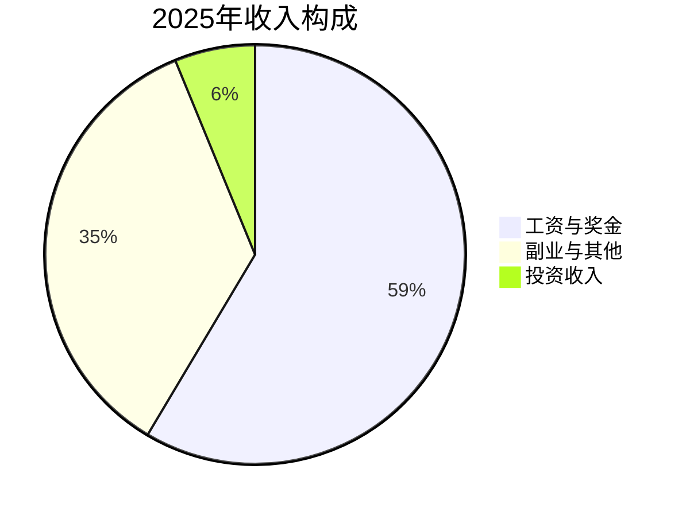
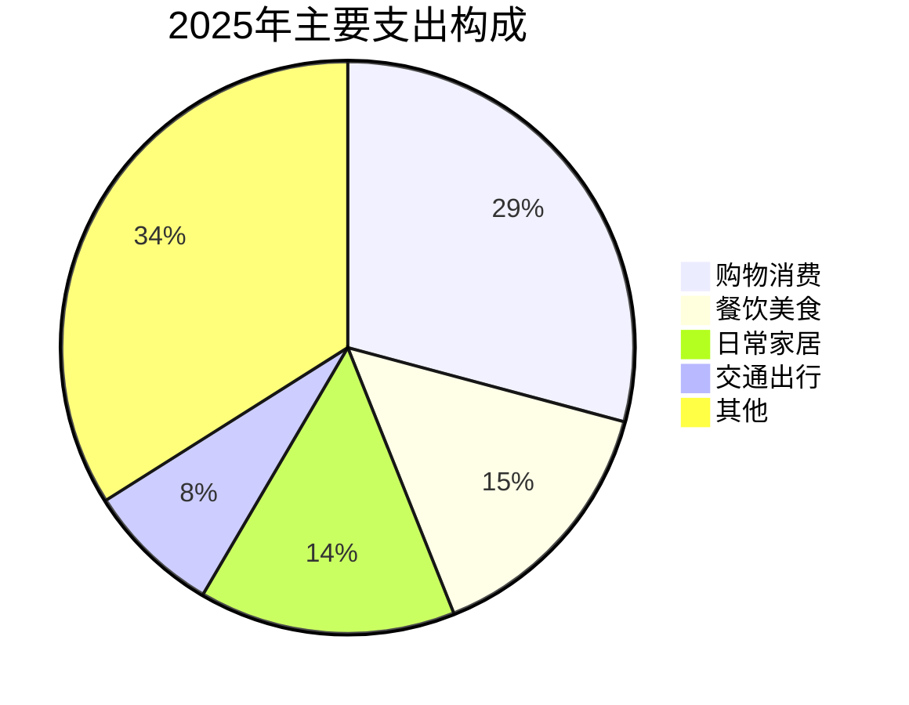
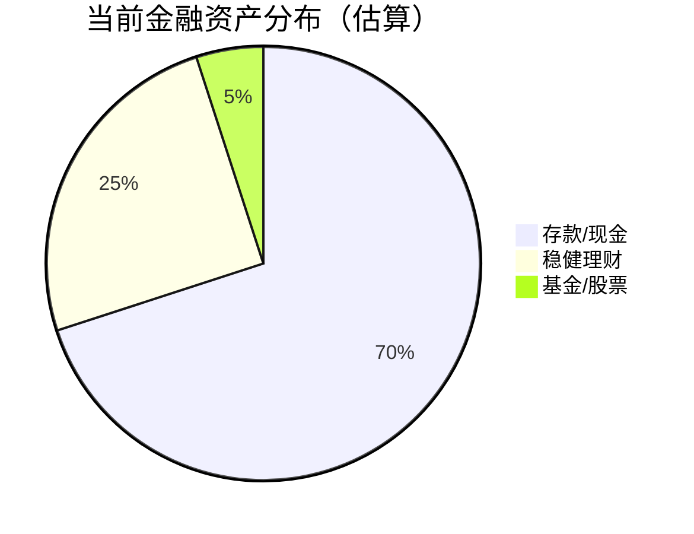
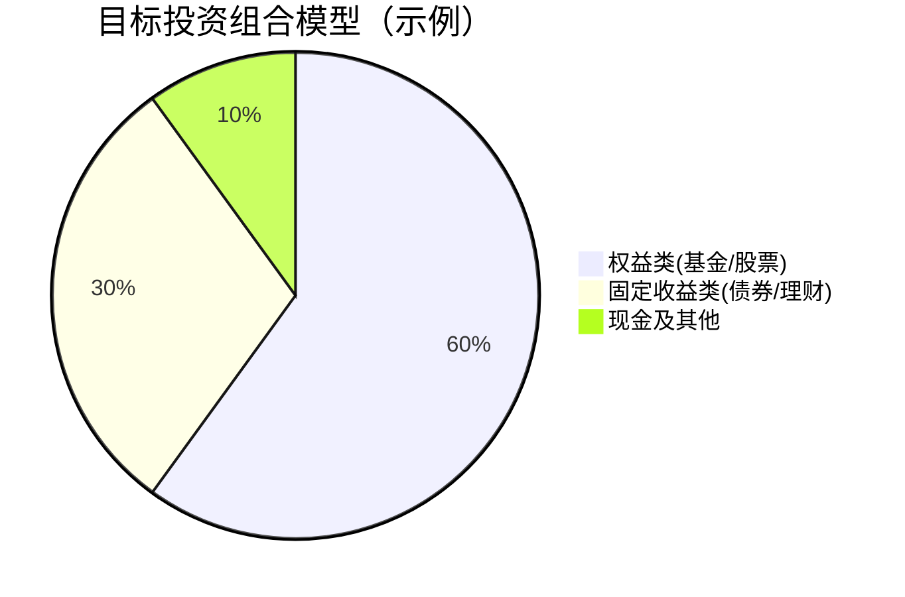

+++
title = "2025家庭财务年报"
+++

---

### **2025家庭财务年报与自由之路规划**
**—— 致为未来并肩奋斗的我们**

本报告基于2025全年收支记录与家庭资产状况编制，旨在全面复盘、清晰展望，为我们共同的财务自由目标（1200万）绘制可执行的路线图。

#### **第一部分：2025财务全景速览**

**1.1 核心财务指标**
| 项目 | 金额 | 说明 |
| :--- | :--- | :--- |
| **全年总收入** | ¥1,223,372 | 家庭财富的源泉，非常健康。 |
| **全年总支出** | ¥603,162 | 消费与生活成本的体现。 |
| **年度净储蓄** | ¥620,211 | **核心引擎**：储蓄率高达 **50.7%**，是绝佳的优势。 |
| **当前家庭净资产** | ~¥5,470,000 | **已达成1200万目标的45.6%**，基础坚实。 |
| **可用于投资的金融资产** | ~¥1,000,000 | 包含存款、理财、基金等，是增值的主力军。 |

**1.2 收入结构：多元化的探索**
我们的收入来源已超越单一工资，向多元化迈进。

*   **工资与奖金**仍是压舱石，占比58.6%。
*   **副业与其他收入**（含挂证、内容创作、羊毛等）占比35.3%，成为重要补充，显示了我们出色的创收能力与敏感性。
*   **投资收入**占比仅6.2%，是未来需要重点提升的部分。

**1.3 支出结构：钱花在哪里了？**
了解支出是优化的第一步。

*   **购物消费**是最大支出项（29.2%），未来可通过预算管理进行优化。
*   **餐饮、日常、交通**支出合理，属于必要生活品质范畴。
*   **投资支出**（未单独显示）主要为理财本金流动，需关注其最终效益。

**1.4 副业收入盘点：星辰大海的起点**
我们已成功开辟多个收入渠道，为财务自由添砖加瓦。
*   **亮点收入**：挂证（¥8,000）、顺风车/共享充电（累计约¥1,200+）、内容创作与羊毛（累计约¥2,300+）。
*   **意义**：尽管总额占比较小，但验证了多元收入的可能性，抗风险能力增强。

#### **第二部分：现状诊断与核心挑战**

**2.1 我们的核心优势**
1.  **强大的"造血"能力**：50.7%的储蓄率是实现任何目标的基石。
2.  **扎实的资产根基**：547万净资产提供了巨大的安全垫和复利起点。
3.  **共同的明确目标**：1200万财务自由目标一致，且已行程近半。
4.  **低成本的良性负债**：公积金贷款利率低，无需提前偿还。

**2.2 面临的关键挑战**
1.  **投资效率亟待提升**：当前整体投资收益率约 **2.5%**，未能跑赢通胀，导致存量财富增值缓慢。
2.  **资产结构流动性不足**：净资产中约81%为自住房产（445万），属于"账面财富"，无法直接产生现金流用于再投资。
3.  **生命周期支出临近**：备孕及未来的育儿规划，将带来持续性的新开支，需提前筹划。

**结论**：我们正处在从 **"高储蓄积累期"** 向 **"高效投资增值期"** 转型的关键节点。提升投资回报率是缩短目标实现年限的唯一杠杆。

#### **第三部分：未来规划 —— "一体两翼"财富加速计划**

为实现 **35-37岁（即未来5-7年）** 达成1200万净资产的目标，我们提出 **"一体两翼"** 战略。

**3.1 战略蓝图**
此战略旨在**协同作战**，将我们的优势最大化。
*   **"一体"：家庭核心投资组合**
    *   **目标**：获取长期稳健回报（目标年化6-8%）。
    *   **管理者**：夫妻共治，协同决策。
    *   **资金**：家庭绝大部分（90%以上）可投资资产及未来储蓄。
    *   **策略**：采用 **"股债平衡"** 的资产配置，例如：60% 宽基/优质主动基金 + 30% 债券/固收 + 10% 行业/灵活配置。
*   **"左翼"：卫星策略账户**
    *   **目标**：在可控范围内，满足对高收益投资的探索欲。
    *   **管理者**：由你主导。
    *   **资金**：从总资产中划拨固定比例（如5%），盈亏限于此账户，绝不追加。
*   **"右翼"：家庭生活与梦想基金**
    *   **目标**：专款专用，保障生活重大计划（如生育、医疗、教育），与投资资金隔离，确保安全与流动性。
    *   **管理者**：共同监督。
    *   **资金**：立即预留 **20-30万** 于高流动性账户。

**3.2 资产配置优化对比**
我们的资产需要从"存款为主"转向"投资为主"。

**3.3 分阶段实施路线图**
| 阶段 | 时间 | 主题 | 核心任务 |
| :--- | :--- | :--- | :--- |
| **一期：奠基** | 2025年 | 体系搭建 | 1. 开设联名投资账户，执行首次资产配置。 2. 设立"生育生活基金"专户。 3. 为"卫星账户"设定规则与初始资金。 |
| **二期：积累** | 2026-2028年 | 系统执行 | 1. 坚持将年储蓄按计划定投于核心组合。 2. 平稳应对育儿带来的支出变化，**保持投资不间断**。 3. 每年进行一次全面财务复盘与微调。 |
| **三期：冲刺** | 2029-2030年 | 目标达成 | 1. 享受复利效应，资产加速增长。 2. 临近目标时，逐步增加配置的稳健性，锁定收益。 |

#### **第四部分：2026年立即行动清单**

1.  **召开家庭财务会议**：对齐本报告认知，确认"一体两翼"战略。
2.  **账户实操**：
    *   开设一个**夫妻联名的证券账户**作为"一体"核心账户。
    *   从存款中拨出 **30万元** 至单独卡/账户，明确为 **"生育与家庭医疗基金"**。
3.  **执行首次配置**：将当前可用金融资产（约100万）按目标比例（如60/30/10）分批买入对应基金产品，完成建仓。
4.  **设立预算**：审视2025年购物支出，为2026年设定合理的月度消费预算。
5.  **持续学习**：每月花少量时间共同学习投资基础知识，关注长期趋势。

---

**最后的寄语**：
这份报告里的每一个数字，都是我们过去一年共同努力的写照；而图表指向的未来，是我们携手共进的蓝图。我们最大的财富不是已有的547万，而是每年创造62万净储蓄的能力，以及彼此支持、共同规划未来的决心。

财务自由之路，道阻且长，行则将至。行而不辍，未来可期。

**（报告结束）**

---
**说明**：您可以将以上Markdown内容复制到任何支持Markdown渲染的编辑器（如Typora、Obsidian）或在线转换网站，直接导出为样式清晰的PDF文档。